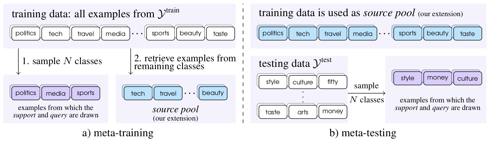

# Few-shot Text Classification with Distributional Signatures

This repository contains the code and data for our ICLR 2020 paper:

*Few-shot Text Classification with Distributional Signatures*. Yujia Bao, Menghua Wu, Shiyu Chang and Regina Barzilay.

If you find this work useful and use it on your own research, please cite our paper.

```
@inproceedings{
	bao2020fewshot,
	title={Few-shot Text Classification with Distributional Signatures},
	author={Yujia Bao and Menghua Wu and Shiyu Chang and Regina Barzilay},
	booktitle={International Conference on Learning Representations},
	year={2020}
}
```

## Overview

Our goal is to improve few-shot classification performance by learning high-quality attention from the distributional signatures of the inputs. Given a particular episode, we extract relevant statistics from the source pool and the support set. Since these statistics only roughly approximate word importance for classification, we utilize an *attention generator* to translate them into high-quality attention that operates over words. This generated attention provides guidance for the downstream predictor, a *ridge regressor*, to quickly learn from a few labeled examples.

<p align="center">

</p>

## Code
`src/main.py` may be run with one of three modes: `train`, `test`, and `finetune`.
- `train` trains the meta-model using episodes sampled from the training data.
- `test` evaluates the current meta-model on 1000 episodes sampled from the testing data.
- `finetune` trains a fully-supervised classifier on the training data and finetunes it on the support set of each episode, sampled from the testing data.


#### Dependencies
- Python 3.7
- PyTorch 1.1.0
- numpy 1.15.4
- torchtext 0.4.0
- pytorch-transformers 1.1.0
- termcolor 1.1.0
- tqdm 4.32.2

### Mac OS
As tryambak007 pointed out, there is an error when using multiprocessing.Queue. Please check out his fork (https://github.com/tryambak007/Distributional-Signatures) for the fix.
